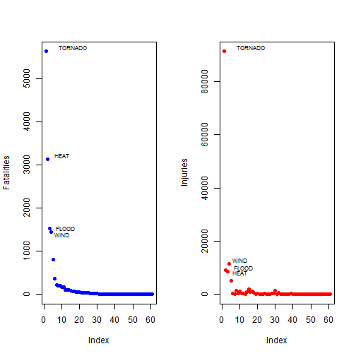
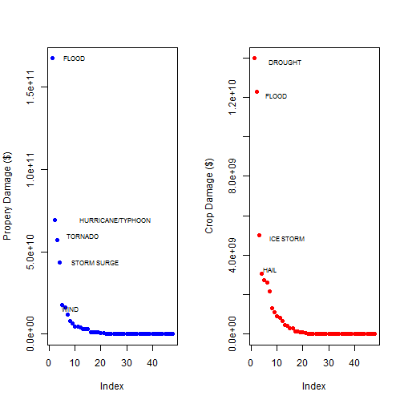

Economic and Health impacts of severe weather events in the United States
==========================================================================

Highlights
-----------
The goal of this analysis is to determine the impact of Severe Weather events on public health and material damage. 
The source of data for this analysis is provided from  National Oceanic and Atmospheric Administration (NOAA). 
It documents the occurrence of storms and other significant weather phenomena having sufficient intensity to cause loss of life, injuries, 
significant property damage, and/or disruption to commerce. The economic and public health impact is categorized by major event types. The impact is reported 
in decreasing order of significance. Data is long-tailed, with only a handful of events causing most of the damage (both material and non-material). 
Flood is the leading cause of property damage followed by Hurricanes, Tornadoes and Storm Surges. Floods Contribute to 39% of property damage and 25% of crop damage.
Drought is th eleading cause of crop damage.Tornado is the leading cause of human damage (Fatalities and injuries) followed by heat flood and wind


Analysis
-------------------

* The data is loaded from a compressed file format
* Event type is converted to upper case. These are further consolidated into  larger buckets
* The Damage is reported by event type in decreasing order of impact
* For certain types of damage like property and crop damage, new metrics were added to represent damage in dollars. These were summarized by event type.
* The totals by event type across time and geography is considered for analysis


### Load libraries

```r
library(plyr)
library(poweRlaw)
library(maptools)
```

```
## Loading required package: sp
## Checking rgeos availability: FALSE
##  	Note: when rgeos is not available, polygon geometry 	computations in maptools depend on gpclib,
##  	which has a restricted licence. It is disabled by default;
##  	to enable gpclib, type gpclibPermit()
```


### Read data

```r
## open zip and extract data
zz <- bzfile("repdata-data-StormData.csv.bz2", open = "r")
data <- read.csv(zz)
close(zz)


## Consolidate names of the weather events
data$EVTYPE <- toupper(data$EVTYPE)
data$EVTYPE[grep("WIND", data$EVTYPE)] <- "WIND"
data$EVTYPE[grep("TORNADO", data$EVTYPE)] <- "TORNADO"
data$EVTYPE[grep("HEAT", data$EVTYPE)] <- "HEAT"
data$EVTYPE[grep("SNOW", data$EVTYPE)] <- "SNOW"
data$EVTYPE[grep("FLOOD", data$EVTYPE)] <- "FLOOD"
data$EVTYPE[grep("RAIN", data$EVTYPE)] <- "RAIN"
data$EVTYPE[grep("HAIL", data$EVTYPE)] <- "HAIL"
data$EVTYPE[grep("BLIZZ", data$EVTYPE)] <- "BLIZZARD"

## check the size of the data
print(object.size(data), units = "Mb")
```

```
## 412.8 Mb
```


### Death and Injuries

```r
## sum deaths and injuries by the event type
total_Human_Damage_by_event <- ddply(data, .(EVTYPE), summarise, fatalities = sum(FATALITIES), 
    injuries = sum(INJURIES))

## sort by deaths and ijuries in the descending order
sorted_HD <- arrange(total_Human_Damage_by_event, desc(fatalities), desc(injuries))

## remove events that made no damage (in terms of injuries or fatalities)
remove_no_damage_HD <- sorted_HD[(sorted_HD$fatalities > 0 & sorted_HD$injuries > 
    0), ]
str(remove_no_damage_HD)
```

```
## 'data.frame':	61 obs. of  3 variables:
##  $ EVTYPE    : chr  "TORNADO" "HEAT" "FLOOD" "WIND" ...
##  $ fatalities: num  5636 3138 1525 1451 816 ...
##  $ injuries  : num  91407 9224 8604 11498 5230 ...
```


### Material Damage

```r
## Create variables that show dollar amount of damage
Multipliers <- c(M = 10^6, m = 10^6, K = 10^3, k = 10^3, B = 10^9, b = 10^9)

## Summarizing property damage
data$sumP <- data$PROPDMG * Multipliers[as.character(data$PROPDMGEX)]
data$sumP[is.na(data$sumP)] <- 0

## Summarizing crop damage
data$sumC <- data$CROPDMG * Multipliers[as.character(data$CROPDMGEXP)]
data$sumC[is.na(data$sumC)] <- 0

## sum damage by event type
total_by_event2 <- ddply(data, .(EVTYPE), summarise, property = sum(sumP), crops = sum(sumC))
sorted2 <- arrange(total_by_event2, desc(property), desc(crops))

## remove events that made no damage
remove_no_damage2 <- sorted2[(sorted2$property > 0 & sorted2$crops > 0), ]
```


Results
------------

### Death And Injuries Statistics
Majority of fatalities/injuries are caused by few events such ass Tornadoes, Floods, Heat and Wind. These as can be understood from their nature are sudden and severe
It can be observed from the data that of all the 570 events recorded only 50 events had fatalities or injuries reported. Tornadoes are the leading cause of death and injury
among all the events reported. For more than 500 deaths category the death to injury ratio is highest for Heat Exposure.


```r
## Top 10 events by fatalities and injuries
head(sorted_HD, 10)
```

```
##          EVTYPE fatalities injuries
## 1       TORNADO       5636    91407
## 2          HEAT       3138     9224
## 3         FLOOD       1525     8604
## 4          WIND       1451    11498
## 5     LIGHTNING        816     5230
## 6   RIP CURRENT        368      232
## 7     AVALANCHE        224      170
## 8  WINTER STORM        206     1321
## 9  RIP CURRENTS        204      297
## 10         SNOW        164     1123
```

```r
dim(sorted_HD)
```

```
## [1] 392   3
```

```r

## total deaths
total_deaths <- sum(remove_no_damage_HD$fatalities)
total_deaths
```

```
## [1] 15061
```

```r

## percentage of deaths caused by tornado
top_death_percentage <- remove_no_damage_HD$fatalities[1]/total_deaths
top_death_percentage
```

```
## [1] 0.3742
```

```r
# percentage of deaths caused by top five events
top_five_deaths <- sum(remove_no_damage_HD$fatalities[1:5])
top_five_deaths_percentage <- top_five_deaths/total_deaths
top_five_deaths_percentage
```

```
## [1] 0.8343
```

```r

## total injuries
total_injuries <- sum(remove_no_damage_HD$injuries)
total_injuries
```

```
## [1] 140386
```

```r
## percentage of injuries caused by tornado
top_injury_percentage <- remove_no_damage_HD$injuries[1]/total_injuries
top_injury_percentage
```

```
## [1] 0.6511
```

```r
# percentage of injuries caused by top five events
top_five_injuries <- sum(remove_no_damage_HD$injuries[1:5])
top_five_injury_percentage <- top_five_injuries/total_injuries
top_five_injury_percentage
```

```
## [1] 0.8973
```


### Property and crop damage
Total crop damage is 48.8 billion dollars. Wet events are the leading cause of damage to property and crops. This could be due to untimely severe wet weather saturating the 
soil and leading to water logging. Floods caused 29% of the total damage, and top 5 events contributed to 76% of the total damage.
Total property damage reported is around 426 billion dollars.Out of the events that did cause property damage, top event (flood) is responsible for about 40% of total damage, and top five events for 84% of total damage.


```r
## Top 10 events by propery and crop damage
head(sorted2, 10)
```

```
##               EVTYPE  property     crops
## 1              FLOOD 1.675e+11 1.227e+10
## 2  HURRICANE/TYPHOON 6.931e+10 2.608e+09
## 3            TORNADO 5.699e+10 4.150e+08
## 4        STORM SURGE 4.332e+10 5.000e+03
## 5               WIND 1.774e+10 2.159e+09
## 6               HAIL 1.597e+10 3.047e+09
## 7          HURRICANE 1.187e+10 2.742e+09
## 8     TROPICAL STORM 7.704e+09 6.783e+08
## 9       WINTER STORM 6.688e+09 2.694e+07
## 10          WILDFIRE 4.765e+09 2.955e+08
```

```r
dim(sorted2)
```

```
## [1] 392   3
```

```r
dim(remove_no_damage2)
```

```
## [1] 48  3
```

```r

## total property damage
total_property_damage <- sum(remove_no_damage2$property)
total_property_damage
```

```
## [1] 4.264e+11
```

```r
## percentage of propery damage caused by flood
top_event_property <- max(remove_no_damage2$property)/total_property_damage
top_event_property
```

```
## [1] 0.3929
```

```r
# percentage of propery damage caused by top five events
top_five_property <- sum(remove_no_damage2$property[1:5])
top_five__property_percentage <- top_five_property/total_property_damage
top_five__property_percentage
```

```
## [1] 0.8323
```

```r

## total crop damage
total_crop_damage <- sum(remove_no_damage2$crops)
total_crop_damage
```

```
## [1] 4.878e+10
```

```r
## percentage of crop damage caused by drought
top_event_crop <- max(remove_no_damage2$crop)/total_crop_damage
top_event_crop
```

```
## [1] 0.2865
```

```r
# percentage of propery damage caused by top five events
sort_crop <- arrange(remove_no_damage2, desc(crops))
top_five_crops <- sum(sort_crop$crops[1:5])
top_five_crops_percentage <- top_five_crops/total_crop_damage
top_five_crops_percentage
```

```
## [1] 0.7596
```


### Create graph showing fatalities  and injuries distribution

```r
library(maptools)
par(mfrow = c(1, 2))
plot(remove_no_damage_HD$fatalities, col = "blue", pch = 16, ylab = "Fatalities")
pointLabel(x = 0, remove_no_damage_HD$fatalities, ifelse(remove_no_damage_HD$fatalities > 
    1000, as.character(remove_no_damage_HD$EVTYPE), NA), allowSmallOverlap = FALSE, 
    cex = 0.7, pos = 4)

plot(remove_no_damage_HD$injuries, col = "red", pch = 16, ylab = "Injuries")
pointLabel(x = 0, remove_no_damage_HD$injuries, ifelse(remove_no_damage_HD$injuries > 
    7000, as.character(remove_no_damage_HD$EVTYPE), NA), allowSmallOverlap = FALSE, 
    cex = 0.7, pos = 4)
```

 


### Create graph showing propery and crop damage distribution

```r
library(maptools)
par(mfrow = c(1, 2))
plot(remove_no_damage2$property, col = "blue", pch = 16, ylab = "Propery Damage ($)")
pointLabel(x = 0, remove_no_damage2$property, ifelse(remove_no_damage2$property > 
    1.7e+10, as.character(remove_no_damage2$EVTYPE), NA), allowSmallOverlap = FALSE, 
    cex = 0.7, pos = 4)

plot(sort_crop$crops, col = "red", pch = 16, ylab = "Crop Damage ($)")
pointLabel(x = 0, sort_crop$crops, ifelse(sort_crop$crops > 2.9e+09, as.character(sort_crop$EVTYPE), 
    NA), allowSmallOverlap = FALSE, cex = 0.7, pos = 4)
```

 

Conclusion
==========================================================
Flood related damages are most severe in causing damage to property and crops. This stresses a need for proper storm water management along with flood prevention and 
property protection measures. Better prediction of sudden severe events will help reduce the chance of injuries and fatalities. Public should heed early warnings
to keep out of harm's way

